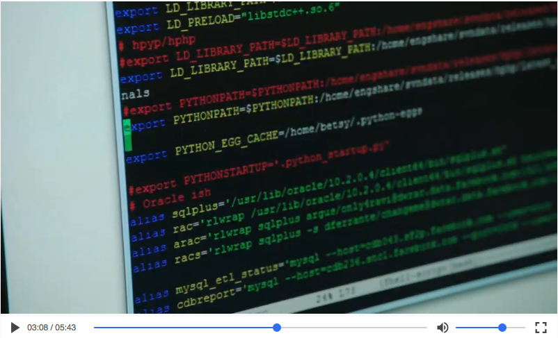

### A react video player

1. clone the repo
2. npm install
3. npm start


```
import React, { Component } from 'react';
import RYPlayer from './RYVideo/RYPlayer';

export default class App extends Component {
  render() {
    let video = {
      poster: 'http://7xj610.com1.z0.glb.clouddn.com/Rectangle-poster.png',
      source: 'http://7xj610.com1.z0.glb.clouddn.com/what-most-schools-dont-teach.mp4',
      autoplay: false,
      loop: true
    }
    return (
      <div className="main">
        <div className="content">
          <RYPlayer video={video} />
        </div>
      </div>
    )
  }
}

```

#### Screen Shot
